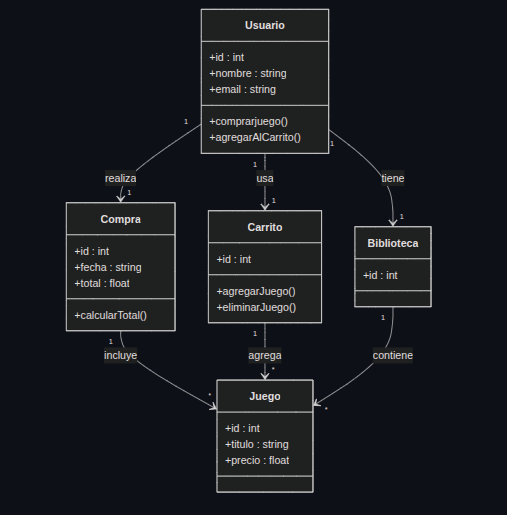

# Reto 2

En este repositorio se encuentra el desarrollo del reto 2, basado en el modelado de un problema de la vida real a través de programación orientada a objetos.

## Descripción del problema

Para este reto se modeló un sistema de compra y gestión de videojuegos.  
El sistema representa cómo un usuario puede agregar juegos a un carrito, realizar una compra y almacenar sus juegos adquiridos en una biblioteca.

## Objetivo

Representar mediante clases, atributos, métodos y relaciones UML un sistema que permita identificar:

- clases principales del problema
- propiedades de cada clase
- comportamientos
- asociaciones entre objetos
- relaciones de composición o uso entre clases

## Clases del sistema

Las clases planteadas en el modelo son:

- `Usuario`
- `Compra`
- `Carrito`
- `Biblioteca`
- `Juego`

## Descripción general de las clases

### Usuario
Representa a la persona que interactúa con el sistema.

**Atributos:**
- id: int
- nombre: string
- email: string

**Métodos:**
- comprarJuego()
- agregarAlCarrito()

### Compra
Representa una transacción realizada por el usuario.

**Atributos:**
- id: int
- fecha: string
- total: float

**Métodos:**
- calcularTotal()

### Carrito
Representa el conjunto de juegos que el usuario desea comprar.

**Atributos:**
- id: int

**Métodos:**
- agregarJuego()
- eliminarJuego()

### Biblioteca
Representa la colección de juegos que ya pertenecen al usuario.

**Atributos:**
- id: int

### Juego
Representa cada videojuego disponible en el sistema.

**Atributos:**
- id: int
- titulo: string
- precio: float

## Relaciones entre clases

- Un `Usuario` realiza una `Compra`.
- Un `Usuario` usa un `Carrito`.
- Un `Usuario` tiene una `Biblioteca`.
- Una `Compra` incluye uno o varios `Juego`.
- Un `Carrito` agrega uno o varios `Juego`.
- Una `Biblioteca` contiene uno o varios `Juego`.

## Diagrama UML

A continuación se presenta el diagrama UML del sistema:

## Explicación de la solución

Se escogió como problema de la vida real un sistema de compra de videojuegos porque permite identificar de forma clara varias entidades del mundo real y sus relaciones.

Primero se definieron las clases principales del sistema: usuario, compra, carrito, biblioteca y juego.  
Después se asignaron atributos para describir la información de cada objeto y métodos para representar su comportamiento.  
Finalmente, se organizaron las relaciones entre las clases en un diagrama UML para mostrar cómo interactúan dentro del sistema.
