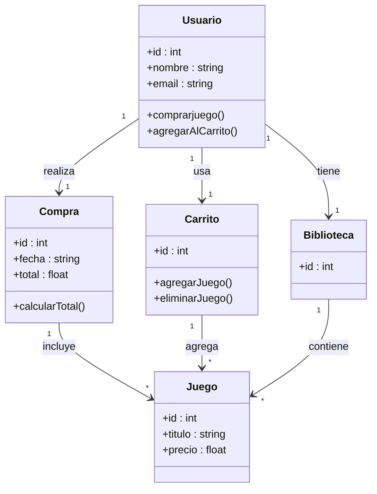

```mermaid
classDiagram

class Usuario {
    +id : int
    +nombre : string
    +email : string
    +comprarjuego ()
    +agregarAlCarrito()
}

class Juego {
    +id : int
    +titulo : string
    +precio : float
}

class Biblioteca {
    +id : int
}

class Carrito {
    +id : int
    +agregarJuego()
    +eliminarJuego()
}

class Compra {
    +id : int
    +fecha : string
    +total : float
    +calcularTotal()
}

Usuario "1" --> "1" Compra : realiza

Compra "1" --> "*" Juego : incluye

Usuario "1" --> "1" Carrito : usa

Carrito "1" --> "*" Juego : agrega
Biblioteca "1" --> "*" Juego : contiene

Usuario "1" --> "1" Biblioteca : tiene
```